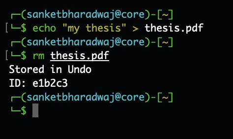
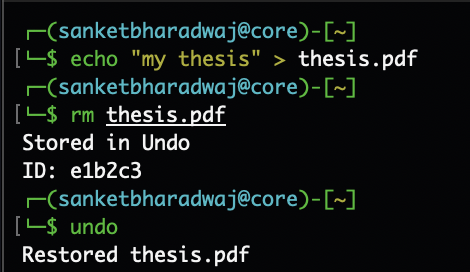
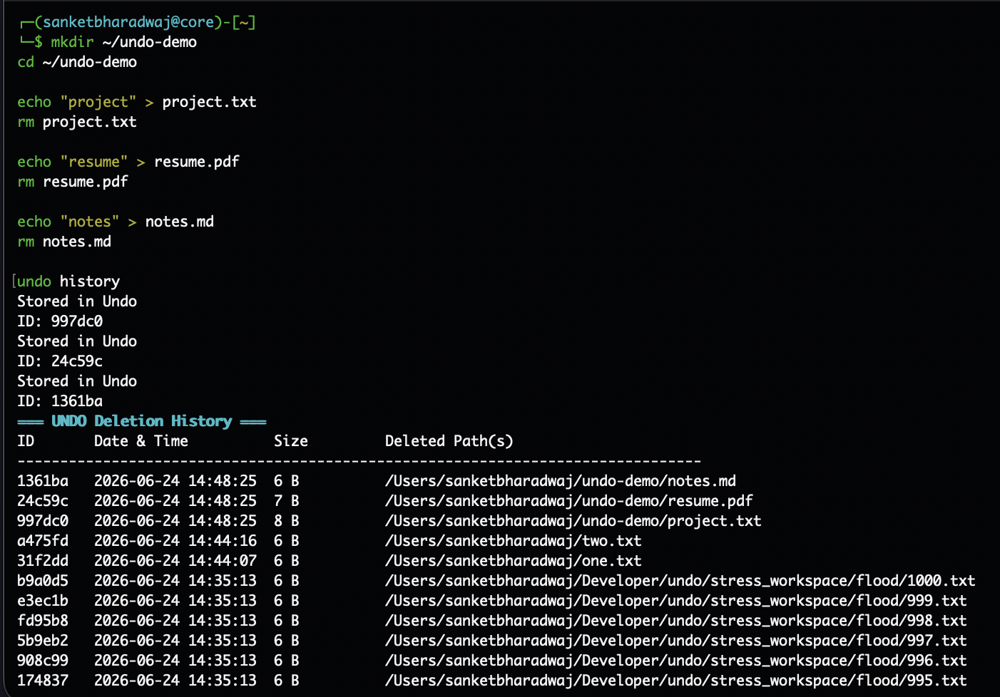
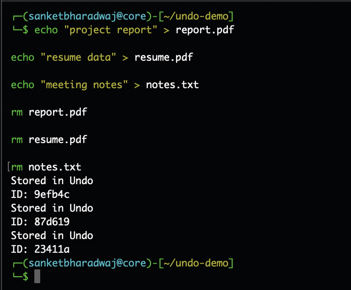

<div align="center">

# Undo

**Recover files you just deleted with `rm`.**

[](LICENSE)
[](#)
[](#)
[](#)

</div>

```bash
rm thesis.pdf
undo
```

```
Restored thesis.pdf
```

Undo sits in front of `rm`, keeps a local backup of what you delete, and lets you bring it back with one command. No daemon, no database, no setup.

---

### Contents

- [Install](#install)
- [Usage](#usage)
- [Screenshots](#screenshots)
- [Why trust it](#why-trust-it)
- [Limitations](#limitations)
- [Configuration](#configuration)
- [How it works](#how-it-works)
- [License](#license)

---

## Install

```bash
curl -sSL https://raw.githubusercontent.com/bharadwajsanket/undo/main/install.sh | bash
```

Or build from source:

```bash
make
```

then copy the resulting binary into your `PATH`.

---

## Usage

Delete a file, then restore it:

```bash
rm thesis.pdf
undo
```

| Command | Description |
|---|---|
| `undo` | Restore the most recent deletion |
| `undo <id>` | Restore a specific deletion by ID |
| `undo history` | List recent deletions |
| `undo stats` | Show storage usage and compression ratio |
| `undo clean` | Clear all stored backups |
| `undo config` | Open interactive configuration |

> Works with `rm -r` and symbolic links.

---

## Screenshots

| | |
|---|---|
| **Deleting a file**<br> | **Restoring it**<br> |
| **Viewing history**<br> | **Checking storage stats**<br> |

---

## Why trust it

| | |
|---|---|
| **Local only** | No network code, no telemetry. Everything stays in `~/.undo`, mode `0700`. |
| **Write-ahead logging** | Deletions are committed to a journal before the original file is removed, so a crash or power loss mid-delete can't leave things half-done. |
| **Safe restores** | Undo refuses to overwrite an existing file at the restore path. |
| **Permissions preserved** | Restored files keep their original mode. |

> Need a permanent delete that bypasses Undo entirely?
> ```bash
> \rm file.txt
> # or
> /bin/rm file.txt
> ```

---

## Limitations

- Only catches deletions made through `rm`. Tools like `find -delete` or `rmdir` aren't intercepted.
- Backups are stored on the same partition as your home directory. If that partition fills up, deletions fail safely rather than silently dropping data.

---

## Configuration

Settings live in `~/.undo/config`:

```ini
large_file_threshold = 104857600   # prompt before storing files larger than this (bytes)
compression = auto                 # auto, on, off
compression_threshold = 1048576    # compress files larger than this (bytes)
```

---

## How it works

Undo intercepts `rm`, writes the target file(s) into `~/.undo/objects/`, and records the transaction in `~/.undo/journal.log` before removal happens. Files above a configurable size are compressed with `zlib`. On startup, Undo scans the journal for incomplete transactions and rolls them back.

---

## License

MIT. See [LICENSE](LICENSE).

<div align="center">

[Report an issue](https://github.com/bharadwajsanket/undo/issues) · [Back to top](#undo)

</div>